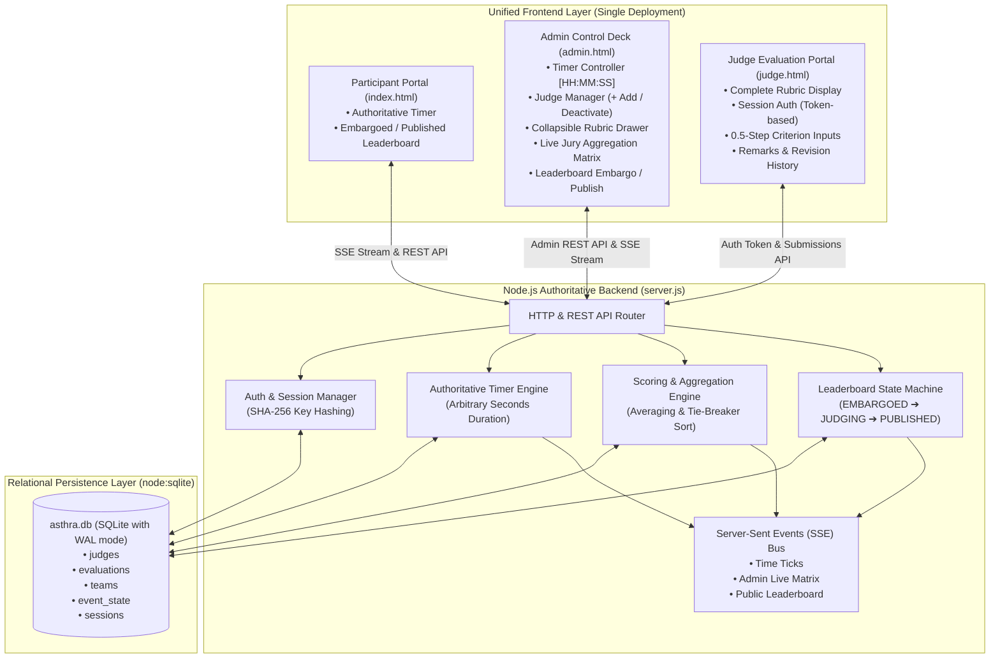

# Production-Grade Architecture & Implementation Plan: Multi-Judge Evaluation System

## Goal Description
Upgrade the **ASTRA 11.0 // BUILD-A-BOT** platform into a competition-certified, distributed multi-judge evaluation and live event management system. 

The architecture consists of three coordinated portals served from a single unified deployment:
1. **Participant Portal (`index.html`)**: Public interface for hackathon teams featuring authoritative timer synchronization and certified leaderboard results under strict embargo control.
2. **Admin Control Deck (`admin.html`)**: Master administrator console providing HH:MM:SS timer controls, on-the-spot judge provisioning, collapsible criteria reference, live multi-judge evaluation aggregation matrix, and immutable leaderboard publication.
3. **Judge Evaluation Portal (`judge.html`)**: Dedicated evaluator portal featuring the full official criteria rubric up front, secure session-based authentication, 0.5-precision criterion scoring, remarks capture, and real-time evaluation history with revision capability.

---

## User Review Required

> [!IMPORTANT]
> **Native SQLite Database Persistence**: In accordance with the requirement to replace raw JSON files with a real persistent database, we will utilize Node 24's built-in `node:sqlite` (`DatabaseSync`). This provides:
> - Full ACID transactions and relational foreign key constraints.
> - Complete immunity to race conditions during simultaneous judge submissions.
> - Zero external database server dependencies (ideal for on-premise college Wi-Fi/LAN reliability).
> - Single-file persistence (`data/asthra.db`) with simple one-command backup (`cp data/asthra.db data/asthra.backup.db`).

> [!NOTE]
> **Session-Based Judge Authentication**: Judges enter their key once (or follow `judge.html?key=J-XXXX`), which is securely exchanged via `POST /api/judges/verify` for a cryptographically random session token. The judge key itself is stored as a SHA-256 hash on the server and is never stored in browser history or repeatedly transmitted on submission requests.

> [!NOTE]
> **Authoritative Server Scoring**: Clients never compute official totals or rankings. All scores ($C1 \dots C6$) are validated against strict maximums and 0.5-step increments server-side. The server computes the official total and executes deterministic tie-breaking (Total Score $\rightarrow$ C4 Functionality $\rightarrow$ C3 Tech $\rightarrow$ C1 Problem).

---

## Architecture Diagram



---

## Database Schema Design (`data/asthra.db`)

We define 5 normalized tables in SQLite with Foreign Key enforcement and Write-Ahead Logging (WAL) enabled:

```sql
PRAGMA foreign_keys = ON;
PRAGMA journal_mode = WAL;

-- 1. Judges Table
CREATE TABLE IF NOT EXISTS judges (
  id TEXT PRIMARY KEY,
  name TEXT NOT NULL,
  key_hash TEXT NOT NULL UNIQUE,
  active INTEGER NOT NULL DEFAULT 1,
  created_at INTEGER NOT NULL
);

-- 2. Sessions Table (Temporary Token Auth)
CREATE TABLE IF NOT EXISTS sessions (
  token TEXT PRIMARY KEY,
  judge_id TEXT NOT NULL REFERENCES judges(id) ON DELETE CASCADE,
  created_at INTEGER NOT NULL,
  expires_at INTEGER NOT NULL
);

-- 3. Teams Table (Pre-registered or dynamically created on evaluation)
CREATE TABLE IF NOT EXISTS teams (
  id TEXT PRIMARY KEY,
  name TEXT NOT NULL UNIQUE,
  domain TEXT NOT NULL,
  created_at INTEGER NOT NULL
);

-- 4. Evaluations Table (Unique per Judge and Team)
CREATE TABLE IF NOT EXISTS evaluations (
  id TEXT PRIMARY KEY,
  judge_id TEXT NOT NULL REFERENCES judges(id) ON DELETE RESTRICT,
  team_id TEXT NOT NULL REFERENCES teams(id) ON DELETE CASCADE,
  c1 REAL NOT NULL CHECK(c1 >= 0 AND c1 <= 20),
  c2 REAL NOT NULL CHECK(c2 >= 0 AND c2 <= 20),
  c3 REAL NOT NULL CHECK(c3 >= 0 AND c3 <= 20),
  c4 REAL NOT NULL CHECK(c4 >= 0 AND c4 <= 25),
  c5 REAL NOT NULL CHECK(c5 >= 0 AND c5 <= 10),
  c6 REAL NOT NULL CHECK(c6 >= 0 AND c6 <= 5),
  total REAL NOT NULL,
  remarks TEXT,
  updated_at INTEGER NOT NULL,
  UNIQUE(judge_id, team_id)
);

-- 5. Event State & Snapshots Table
CREATE TABLE IF NOT EXISTS event_state (
  key TEXT PRIMARY KEY,
  value TEXT NOT NULL,
  updated_at INTEGER NOT NULL
);
```

---

## Detailed Component Specifications

### 1. Backend Server & API (`server.js`)

#### A. Timer Engine (`/api/timer/*`)
- **Authoritative Endpoints**:
  - `GET /api/timer`: Returns `{ status, duration, remaining, startTimestamp, endTimestamp, lastUpdated }`.
  - `POST /api/timer/set`: Accepts `{ hours, minutes, seconds }`, computes total seconds, sets state to `idle`, updates DB.
  - `POST /api/timer/start`: Calculates `endTimestamp = now + remaining * 1000`, sets status `running`, broadcasts SSE.
  - `POST /api/timer/pause`: Saves remaining seconds, sets status `paused`, broadcasts SSE.
  - `POST /api/timer/resume`: Recomputes `endTimestamp = now + remaining * 1000`, sets status `running`.
  - `POST /api/timer/stop`: Halts timer immediately, sets status `stopped`.
  - `POST /api/timer/reset`: Restores `remaining = duration`, status `idle`.

#### B. Judge Authentication & Management (`/api/judges/*`)
- `POST /api/judges`: Admin creates a judge (`{ name }`). Generates a 6-character key (e.g. `J-4821`), computes SHA-256 hash for database storage, and returns the raw key to Admin *only once*.
- `GET /api/judges`: Admin retrieves all judges with status, creation time, and evaluated team count.
- `POST /api/judges/deactivate`: Toggles `active` status without deleting historical scores.
- `POST /api/judges/verify`: Judge submits `{ key }`. Server hashes key, looks up active judge, generates an auth session token (UUID v4), and returns `{ token, judge: { id, name } }`.
- Protected judge endpoints validate `Authorization: Bearer <token>`.

#### C. Evaluation Submission API (`/api/submissions`)
- `POST /api/submissions`: Authenticated judge submits:
  ```json
  {
    "teamName": "CyberPulse",
    "domain": "01 - AI Agents & Autonomous Systems",
    "scores": { "c1": 18.0, "c2": 17.5, "c3": 19.0, "c4": 23.5, "c5": 9.0, "c6": 4.5 },
    "remarks": "Solid prototype, verified live API."
  }
  ```
- **Validation Rules**:
  - Checks each criterion range and ensures `Math.round(val * 2) === val * 2` (0.5 increments).
  - Calculates `total = c1 + c2 + c3 + c4 + c5 + c6`.
  - Upserts into `evaluations` table (replaces prior submission from same judge for same team).
  - Sanitizes `remarks` against HTML/script injection.
  - Re-computes live jury aggregation matrix and emits SSE event to Admin.

#### D. Leaderboard State Machine & Snapshotting (`/api/leaderboard/*`)
- States: `EMBARGOED` $\rightarrow$ `JUDGING` $\rightarrow$ `READY_TO_PUBLISH` $\rightarrow$ `PUBLISHED` $\rightarrow$ `LOCKED`.
- `GET /api/admin/preview`: Admin-only endpoint returning the live aggregation matrix (team breakdown per judge, averages, tie-break rank).
- `POST /api/leaderboard/publish`: Admin explicitly certfies standings. The server generates an **immutable snapshot**:
  ```json
  {
    "state": "PUBLISHED",
    "publishedAt": 1726330000000,
    "version": 1,
    "rankings": [
      { "rank": 1, "teamName": "CyberPulse", "domain": "01", "avgTotal": 92.33, "avgC4": 24.0, "award": "1ST PRIZE" }
    ]
  }
  ```
- `GET /api/leaderboard`: Public endpoint. If state is not `PUBLISHED`, returns `{ state: "EMBARGOED", teams: [] }`.

---

### 2. Admin Control Deck (`admin.html` & `admin.js`)

- **Timer Console**:
  - Direct input slots: `[ HH ]` hours : `[ MM ]` minutes : `[ SS ]` seconds.
  - Presets: `2 Hours (Coding Sprint)`, `1 Hour`, `5 Minutes (Pitch Window)`, `3 Minutes (Pitch Only)`, `2 Minutes (Q&A Only)`, `1 Minute (Test)`.
  - Big clock display adapting to `HH:MM:SS` or `MM:SS`.
- **Collapsible Rubric Drawer**:
  - `[ 📋 VIEW OFFICIAL JUDGING RUBRIC ▼ ]` button toggles a smooth drawer displaying the complete 6 criteria, scoring bins, zero-functionality penalty rule, and tie-breaking hierarchy.
- **Judge Provisioning Console**:
  - `+ ADD NEW JUDGE` modal/form.
  - Interactive table showing: Judge Name, Key (shown upon generation), Evaluated Teams Count, One-Click Copy Direct Link (`judge.html?key=...`), and Deactivate toggle.
- **Live Jury Evaluation Matrix**:
  - Real-time updating table showing:
    - Team Name & Domain
    - Individual Judge Score columns (e.g. `Judge 1: 91.5`, `Judge 2: 88.0`, `Judge 3: 94.0`)
    - Calculated Average Total Score (`91.17 / 100`)
    - Tie-breaker averages: `C4 (Functionality)`, `C3 (Tech)`, `C1 (Problem)`
    - Remarks drawer viewer
  - Controls: `[ 🔓 PUBLISH & REVEAL LEADERBOARD ]` and `[ 🔒 LOCK EMBARGO ]`.

---

### 3. Judge Evaluation Portal (`judge.html` & `judge.js`)

- **Top Section — Full Criteria Display**:
  - Complete criteria details visible right at the top so evaluators have immediate reference to the official rubric.
- **Authentication Card**:
  - Input for Judge Key.
  - Auto-authenticates if `?key=...` is present in URL.
  - Exchanged for session token via `POST /api/judges/verify`.
  - Once verified, displays "Authenticated as Judge: [Name]" with "Switch / Logout" button.
- **Evaluation Form**:
  - Team Name input / autocomplete selector.
  - 15 Domains dropdown.
  - Criteria scoring fields with 0.5 step buttons and validation indicators.
  - Live total score indicator (`0.0 / 100`).
  - Remarks / Technical opinion textarea.
  - `[ UPLOAD MARKS TO ADMIN DESK ]` button.
- **Evaluation History**:
  - List of teams previously scored by this judge with quick `Edit` buttons to reload and revise scores before final lock.

---

### 4. Participant Portal (`index.html` & `script.js`)

- **Clock Display**:
  - Updated to show `HH:MM:SS` when $\ge 1$ hour remains (e.g. `02:00:00`), and `MM:SS` under an hour (e.g. `05:00`).
- **Leaderboard Integration**:
  - Displays embargo locked banner until official snapshot is published by Admin.
  - Renders certified standings without ever calculating scores on client side.

---

## Verification & Testing Plan

### 1. Database & Persistence Test
1. Start server with SQLite database initialization.
2. Provision 3 judges via Admin.
3. Submit 4 team evaluations across the judges.
4. Kill the server process (`kill -9`) and restart.
5. Verify via API and UI that all judges, sessions, and evaluations are 100% intact.

### 2. Timer Authoritative Test
1. Set duration to `02:00:00` from Admin.
2. Confirm Participant portal displays `02:00:00`.
3. Start timer, pause after 10s, verify both Admin and Participant stay frozen at `01:59:50`.
4. Refresh participant browser; verify it re-fetches `01:59:50` from server without drifting.

### 3. Multi-Judge Scoring & Averaging Test
1. Judge 1 scores Team Alpha: Total = 92.0 (C4 = 24.0).
2. Judge 2 scores Team Alpha: Total = 88.0 (C4 = 22.0).
3. Verify Admin Live Matrix calculates: Average Total = `90.00`, Average C4 = `23.00`.
4. Submit tie-breaker test: Team Beta with Total = 90.00 (C4 = 21.00). Confirm Team Alpha ranks #1 due to higher C4.

### 4. Embargo & Publication Test
1. With leaderboard embargoed, inspect Participant portal network traffic to ensure unreleased scores are strictly absent.
2. Admin clicks "Publish & Reveal".
3. Verify Participant portal updates in real time to display the certified snapshot.
4. Admin clicks "Lock Embargo"; verify Participant portal immediately re-locks.
